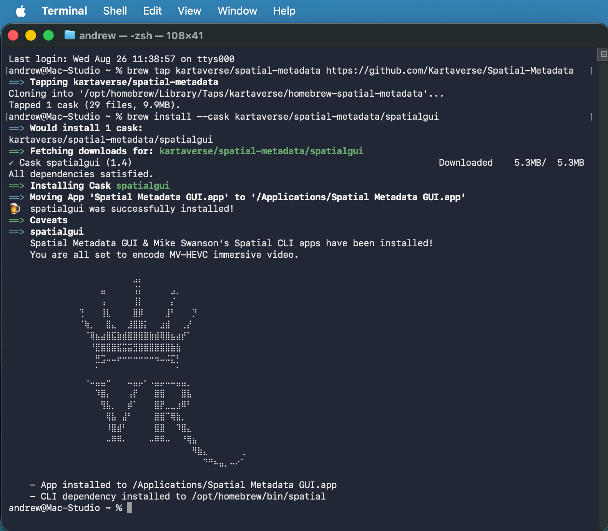

# Homebrew Spatial Metadata GUI Cask

A [Homebrew](https://brew.sh/) tap for the [Spatial Metadata GUI](https://github.com/Kartaverse/Spatial-Metadata/) software on macOS



## Install

The Homebrew package manager for macOS is installed using the terminal command:

```bash
/bin/bash -c "$(curl -fsSL https://raw.githubusercontent.com/Homebrew/install/HEAD/install.sh)"
```

Spatial Metadata GUI and the Spatial CLI toolset can then be installed using Homebrew's "brew" CLI tool:

```bash
brew tap kartaverse/spatial-metadata https://github.com/Kartaverse/Spatial-Metadata
brew install --cask kartaverse/spatial-metadata/spatialgui
```

If you need more detailed information for the brew install process you can run:

```bash
brew install --cask --verbose --debug kartaverse/spatial-metadata/spatialgui
```

## Brew Status Info

If the Spatial Metadata GUI and the Spatial CLI install process was successfull using brew, the terminal window should display the following details:

```
% brew tap kartaverse/spatial-metadata https://github.com/Kartaverse/Spatial-Metadata
==> Tapping kartaverse/spatial-metadata
Cloning into '/opt/homebrew/Library/Taps/kartaverse/homebrew-spatial-metadata'...
Tapped 1 cask (29 files, 9.9MB).
% brew install --cask kartaverse/spatial-metadata/spatialgui            
==> Auto-updating Homebrew...
Adjust how often this is run with `$HOMEBREW_AUTO_UPDATE_SECS` or disable with
`$HOMEBREW_NO_AUTO_UPDATE=1`. Hide these hints with `$HOMEBREW_NO_ENV_HINTS=1` (see `man brew`).
==> Auto-updated Homebrew!
==> Updated Homebrew from 01c6a74422 to a079638b04.
No changes to formulae or casks.

==> Would install 1 cask:
kartaverse/spatial-metadata/spatialgui
==> Fetching downloads for: kartaverse/spatial-metadata/spatialgui
✔︎ Cask spatialgui (1.4)                                                                     Downloaded    5.3MB/  5.3MB
All dependencies satisfied.
==> Installing Cask spatialgui
==> Moving App 'Spatial Metadata GUI.app' to '/Applications/Spatial Metadata GUI.app'
🍺  spatialgui was successfully installed!
==> Caveats
==> spatialgui
    Spatial Metadata GUI & Mike Swanson's Spatial CLI apps have been installed!
    You are all set to encode MV-HEVC immersive video.

⠀⠀⠀⠀⠀⠀⠀⠀⠀⠀⠀⠀⠀⠀⠀⠀⠀⠀⠀⠀⠀⠀⠀⣠⡄⠀⠀⠀⠀⠀⠀⠀⠀⠀⠀⠀⠀⠀⠀⠀⠀⠀⠀⠀
⠀⠀⠀⠀⠀⠀⠀⠀⠀⠀⠀⠀⠀⠀⠀⠀⠀⣤⠀⠀⠀⠀⠀⢨⡅⠀⠀⠀⠀⠀⣠⡀⠀⠀⠀⠀⠀⠀⠀⠀⠀⠀⠀⠀
⠀⠀⠀⠀⠀⠀⠀⠀⠀⠀⠀⠀⠀⠀⠀⠀⠀⢠⠀⠀⠀⠀⠀⢸⡇⠀⠀⠀⠀⠀⡌⠀⠀⠀⠀⠀⠀⠀⠀⠀⠀⠀⠀⠀
⠀⠀⠀⠀⠀⠀⠀⠀⠀⠀⠀⠀⠀⢙⠀⠀⠀⢸⣇⠀⠀⠀⠀⣿⡿⠀⠀⠀⠀⣸⠃⠀⠀⠀⡙⠀⠀⠀⠀⠀⠀⠀⠀⠀
⠀⠀⠀⠀⠀⠀⠀⠀⠀⠀⠀⠀⠀⠈⢷⡀⠀⠀⣿⣄⠀⠀⣸⣿⣿⡅⠀⠀⣰⣾⠀⠀⢀⡜⠀⠀⠀⠀⠀⠀⠀⠀⠀⠀
⠀⠀⠀⠀⠀⠀⠀⠀⠀⠀⠀⠀⠀⠀⠈⢿⣦⣴⣿⣯⣷⣾⣿⣿⣿⣿⣷⣾⢿⣿⣦⣴⡞⠁⠀⠀⠀⠀⠀⠀⠀⠀⠀⠀
⠀⠀⠀⠀⠀⠀⠀⠀⠀⠀⠀⠀⠀⠀⠀⠘⣟⣿⣿⣿⣯⣭⣭⣻⣿⣿⣿⣿⣿⣿⣷⣷⠀⠀⠀⠀⠀⠀⠀⠀⠀⠀⠀⠀
⠀⠀⠀⠀⠀⠀⠀⠀⠀⠀⠀⠀⠀⠀⠀⠀⣛⣩⠤⠤⠖⠒⠒⠒⠒⠒⠒⠲⠤⠬⣍⡃⠀⠀⠀⠀⠀⠀⠀⠀⠀⠀⠀⠀
⠀⠀⠀⠀⠀⠀⠀⠀⠀⠀⠀⠀⠀⠀⠀⠀⠁⠀⠀⠀⠀⠀⠀⠀⠀⠀⠀⠀⠀⠀⠀⠁⠀⠀⠀⠀⠀⠀⠀⠀⠀⠀⠀⠀
⠀⠀⠀⠀⠀⠀⠀⠀⠀⠀⠀⠀⠀⠀⠐⠤⣤⣤⠒⠀⠀⠀⠤⣤⡤⠂⠠⣤⡤⠤⠤⣤⣤⡀⠀⠀⠀⠀⠀⠀⠀⠀⠀⠀
⠀⠀⠀⠀⠀⠀⠀⠀⠀⠀⠀⠀⠀⠀⠀⠀⠹⣿⡄⠀⠀⠀⢠⡟⠀⠀⠀⣿⣿⠀⠀⠀⣿⣧⠀⠀⠀⠀⠀⠀⠀⠀⠀⠀
⠀⠀⠀⠀⠀⠀⠀⠀⠀⠀⠀⠀⠀⠀⠀⠀⠀⢻⣧⡀⠀⠀⡾⠁⠀⠀⠀⣿⡟⣀⣀⣰⠿⠃⠀⠀⠀⠀⠀⠀⠀⠀⠀⠀
⠀⠀⠀⠀⠀⠀⠀⠀⠀⠀⠀⠀⠀⠀⠀⠀⠀⠀⢿⣧⠀⣼⠃⠀⠀⠀⠀⣿⣿⠉⢿⣷⡀⠀⠀⠀⠀⠀⠀⠀⠀⠀⠀⠀
⠀⠀⠀⠀⠀⠀⠀⠀⠀⠀⠀⠀⠀⠀⠀⠀⠀⠀⠸⣿⣾⠃⠀⠀⠀⠀⠀⣿⣿⠀⠀⠹⣿⣄⠀⠀⠀⠀⠀⠀⠀⠀⠀⠀
⠀⠀⠀⠀⠀⠀⠀⠀⠀⠀⠀⠀⠀⠀⠀⠀⠀⠀⠤⠿⠿⠄⠀⠀⠀⠀⠤⠿⠿⠤⠀⠀⠘⢿⣦⠀⠀⠀⠀⠀⠀⠀⠀⠀
⠀⠀⠀⠀⠀⠀⠀⠀⠀⠀⠀⠀⠀⠀⠀⠀⠀⠀⠀⠀⠀⠀⠀⠀⠀⠀⠀⠀⠀⠀⠀⠀⠀⠀⠻⣷⣄⠀⠀⠀⠀⠀⠀⢀
⠀⠀⠀⠀⠀⠀⠀⠀⠀⠀⠀⠀⠀⠀⠀⠀⠀⠀⠀⠀⠀⠀⠀⠀⠀⠀⠀⠀⠀⠀⠀⠀⠀⠀⠀⠀⠙⠛⠦⣤⡀⠤⠔⠁

    - App installed to /Applications/Spatial Metadata GUI.app
    - CLI dependency installed to /opt/homebrew/bin/spatial
```

## Uninstall

To remove Spatial Metadata GUI and untap the repository:

```bash
brew uninstall --cask kartaverse/spatial-metadata/spatialgui
brew untap kartaverse/spatial-metadata
```
