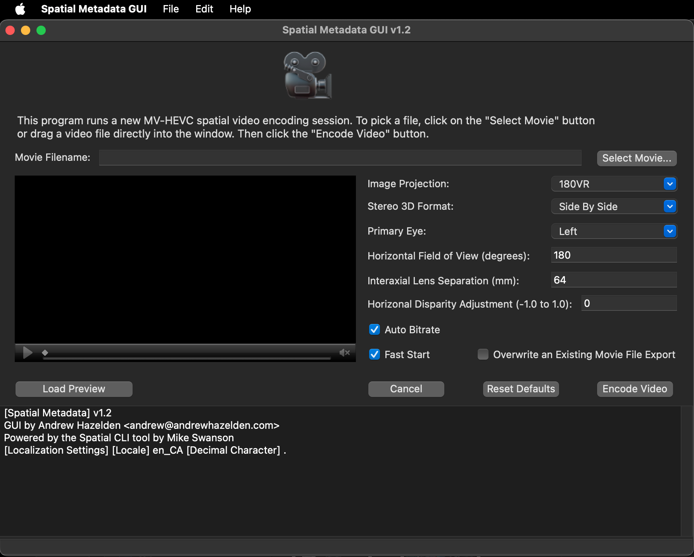
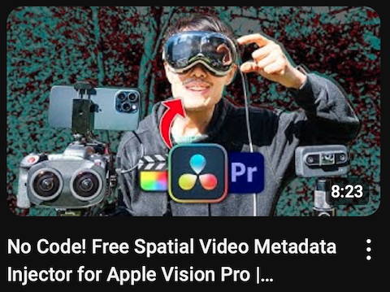
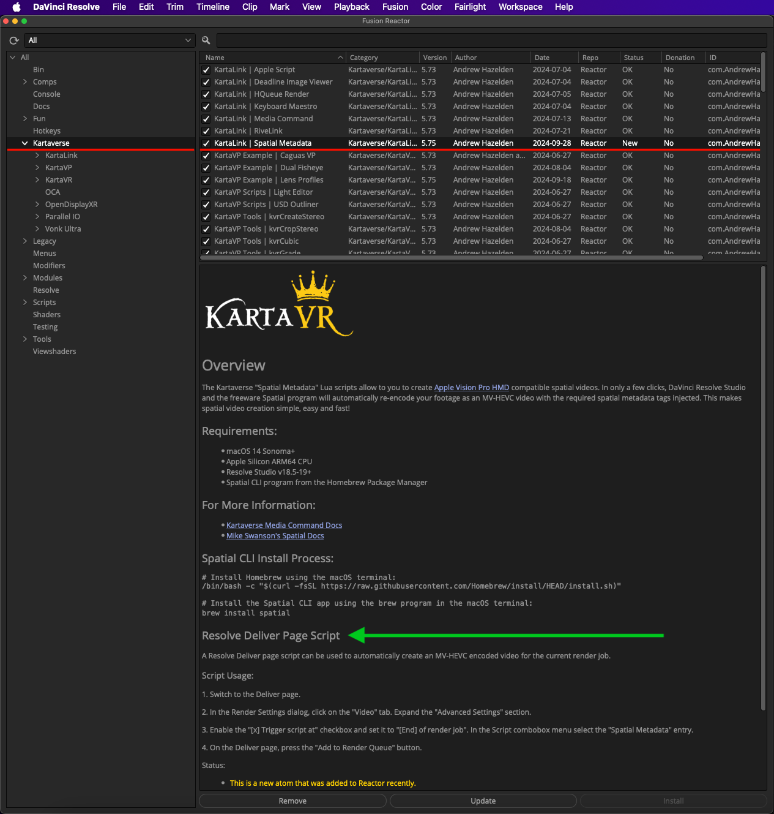

# Spatial Metadata GUI

GUI by Andrew Hazelden <andrew@andrewhazelden.com>  
Powered by the [Spatial CLI](https://blog.mikeswanson.com/spatial-video/) tool by Mike Swanson  

## Overview

This program runs a new MV-HEVC spatial video encoding session. To pick a file, click on the "Select Movie" button or drag a video file directly into the window. Then click the "Encode Video" button.




## Download

The Spatial Metadata GUI downloads are provided using the GitHub releases mechanism. To download the program you simply have to click on the "[Releases](https://github.com/Kartaverse/Spatial-Metadata/releases)" sidebar link to access the 10MB zip archive.

When you expand the zip file you will have access to the following toolset:


## Video Tutorial

Learn how to encode next-gen MV-HEVC spatial video for playback on Apple Vision Pro and Meta Quest HMDs. This video covers the Spatial Metadata GUI as a standalone tool, and as a media command/trigger script that works inside of BMD Resolve (Free)/Resolve Studio: [YouTube | No Code! Free Spatial Video Metadata Injector for Apple Vision Pro | Standalone & DaVinci Resolve](https://www.youtube.com/watch?v=PJWsscXmJiE)

[](https://www.youtube.com/watch?v=PJWsscXmJiE)


## Requirements

The Spatial Metadata GUI is compatible with macOS systems that run macOS 14+ (Sonoma).

It relies on the [Spatial CLI](https://blog.mikeswanson.com/spatial-video/) program that can be installed using the macOS based [Homebrew](https://brew.sh/) package manager.

		# Install Homebrew using the macOS terminal:
		/bin/bash -c "$(curl -fsSL https://raw.githubusercontent.com/Homebrew/install/HEAD/install.sh)"
		
		# Install the Spatial CLI app using the brew program in the macOS terminal:
		brew install spatial
		
		# The Spatial CLI app now lives on your hard disk at:
		/opt/homebrew/bin/spatial

		# If you want to uninstall the Spatial CLI app using brew in the macOS terminal:
		brew uninstall spatial


## Change Log

### Version 1 (2024-07-14)

- Initial Release

### Version 1.2 (2024-08-15)

- Clicking on the "movie camera" icon in the GUI  opens the project's GitHub page in your default web browser.
- The program includes localization support for numbers in text fields. This means comma vs period decimal separators are handled automatically based upon your current locale settings. The localized values are then translated into the correct format for the Spatial CLI tool.
- The "Fast Start" checkbox is used to place a QuickTime "Moov" atom at the start of the video file. This helps with network playback of media that is progressively downloaded.
- An "Overwrite an Existing Movie File Export" checkbox allows you to re-export the encoded video file with different parameters. When this checkbox is enabled, the Spatial Metadata GUI program will replace a pre-existing video export that has the same filename.

### Version 1.3 (2024-09-17)

- Added a JSON preference saving system that can save/restore the last values used in the GUI the next time you launch the Spatial Metadata GUI app. The preference file is saved to:
"```$HOME/Library/Application Support/Kartaverse/Spatial Metadata GUI.json```"

## DCC Tool Integrations

This same metadata embedding toolset is also available for use inside of BMD's DaVinci Resolve Studio video editing software via the "[KartaLink | Spatial Metadata](https://kartaverse.github.io/Reactor-Docs/#/com.AndrewHazelden.KartaLink.Scripts.SpatialMetadata)" scripts that can be installed using the [Reactor Package Manager](https://kartaverse.github.io/Reactor-Docs/#/reactor).



### Media Command Script

The DaVinci Resolve version of the Spatial Metadata toolset allows you to work with immersive footage using Resolve Media Pool "bins". The Kartaverse [Media Command](https://kartaverse.github.io/Kartaverse-Docs/#/mediacommand) launched "Spatial Metadata.lua" script is used to batch processes 180VR, 360VR, fisheye, or flat image projection videos into MV-HEVC encoded content in only a few clicks. This multi-view encoded stereoscopic 3D material is ready for playback on devices like Apple Vision Pro HMDs and Meta Quest HMDs.


### Deliver Page Trigger Script

You also have access to a trigger script that performs DaVinci Resolve based Deliver page MV-HEVC video encoding on your latest video exports. To start with, your edited XR video content in DaVinci Resolve should be formatted as either a stereo 3D SBS or Over/Under frame layout, in a Spatial flat, 180VR, or 360VR image projection.

To use the Kartaverse provided MV-HEVC encoding capability you simply go to the Deliver page and enable an "End" of render job based Trigger script. Then select the "Spatial Metadata" entry in the Trigger script combo menu.

A key thing to consider is Deliver page trigger scripts run without a user interface. This means the "Spatial Metadata" trigger script uses the most recent MV-HEVC encoding settings you defined in the Kartaverse "Media Command" user interface based "Spatial Metadata" script.

#### Spatial Metadata Trigger Script Usage:

1. Switch to the Deliver page.

2. In the Render Settings dialog, click on the "Video" tab. Expand the "Advanced Settings" section.

3. Enable the "[x] Trigger script at" checkbox and set it to "[End] of render job". In the Script combobox menu select the "Spatial Metadata" entry.


4. On the Deliver page, press the "Add to Render Queue" button. 

You can watch the status of the post-render MV-HEVC video encoding stage in the Resolve Console window.


## Source Code

The "Spatial Metadata GUI" wrapper source code is open-source licensed. It is available using the LGPL/GPL v3 license terms.

The "Spatial Metadata GUI.app" wrapper program was compiled using the [Xojo](https://xojo.com/) rapid application development tools on macOS. Xojo is a really quick and efficient toolset to use for creating wrapper GUIs for command line tools, or for building GUI based desktop utilities.


